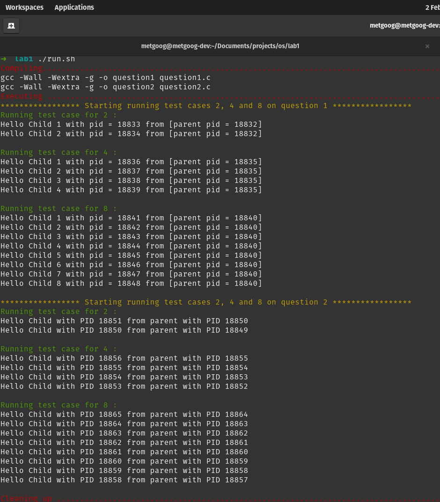

## Algorithm and Thought process for question 2

### Process Chain Creation in C

This program creates a chain of processes in C using the `fork()` system call. The main idea is to create a parent-child relationship where each child process creates its own child, forming a chain of processes.

### Thought Process

The main challenge in this task is to ensure that each child process creates its own child, rather than having the original parent create all the child processes. This is achieved by using recursion and the `fork()` system call.

### Algorithm

1. The `createProcessChain` function is called with two arguments: `depth` (the total number of processes to be created) and `current` (the current level in the process chain).

2. If the current level is less than or equal to the total depth, a new process is created using `fork()`. The PID of the new process is stored in `childPid`.

3. If `fork()` returns -1, an error occurred and the program exits with a failure status.

4. If `fork()` returns 0, we are in the child process. If the current level is less than the total depth, `createProcessChain` is called recursively to create the next process in the chain. The child process then prints its PID and its parent's PID, and exits with a success status.

5. If `fork()` returns a positive number, we are in the parent process. The parent process waits for its child to finish using `wait(NULL)`.

This algorithm ensures that a chain of processes is created, with each child process creating its own child. The parent process waits for its child to finish before it exits, ensuring that the first parent (the one that started the chain) exits last.


## Running the tests
The project contains a bash script run.sh that compiles the code and runs the test cases for both questions.

To run the tests, make the script executable and run it:

```markdown
```bash
cd <project-directory>
chmod +x run.sh
./run.sh


```

- Screenshot of sample output of the automatica testing with the bash script




## Running question1.c independently

To run `question1.c` independently, you need to compile it first. You can use the `gcc` compiler for this. Here's how you can do it:

```bash
gcc -o question1 question1.c


```
### To run the executable, use the following command:
```bash
./question1 <number-of-processes>
```

- Replace <number-of-processes> with the number of child processes you want to create. For example, if you want to create 5 child processes, you would run:
```bash
./question1 4
```


## Running question2.c independently

To run `question2.c` independently, you need to compile it first. You can use the `gcc` compiler for this. Here's how you can do it:

```bash
gcc -o question2 question2.c

```

```bash
./question2 <number-of-processes>
```


```bash
./question2 5
```